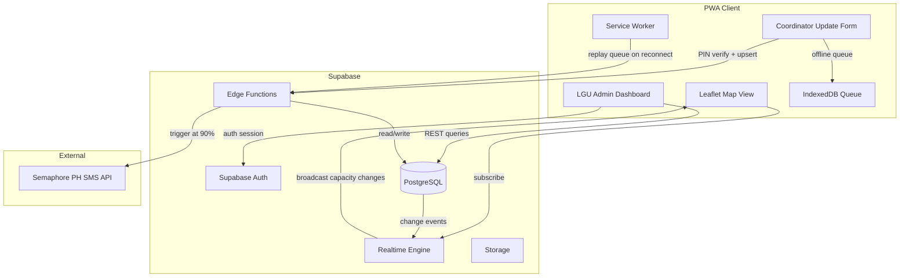
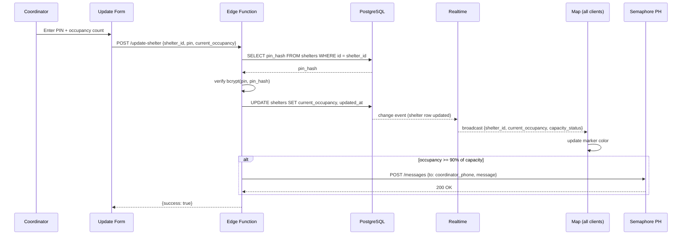
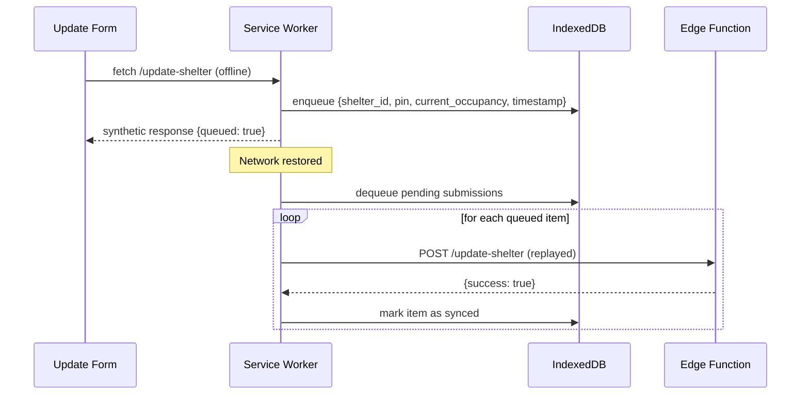
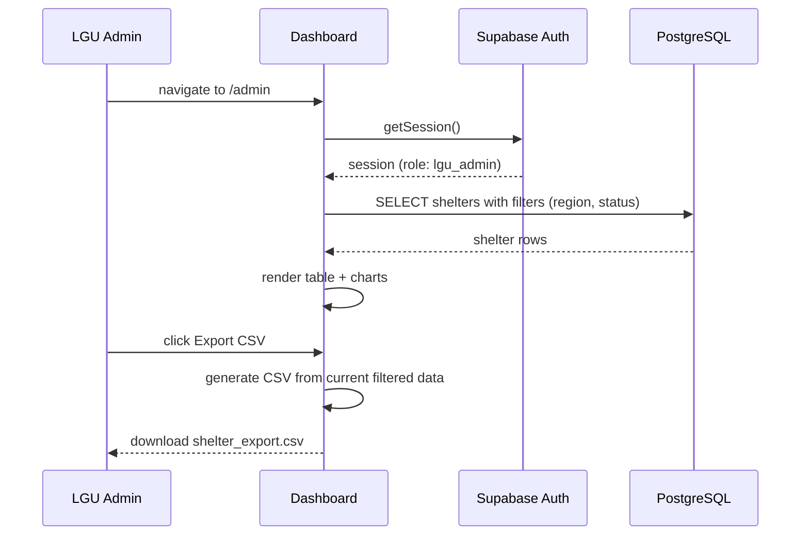

# Design Document: ShelterMap

## Overview

ShelterMap is a mobile-first Progressive Web App (PWA) that provides real-time visibility into evacuation center capacity during disaster events. It combines a Leaflet map with color-coded markers, an offline-capable coordinator update form, and an LGU admin dashboard — all backed by Supabase (PostgreSQL, Realtime, Auth, Edge Functions) with Semaphore PH SMS alerts when centers reach critical capacity.

The system serves three distinct user roles: the general public (read-only map view), shelter coordinators (PIN-authenticated capacity updates), and LGU administrators (full dashboard with filtering, CSV export, and occupancy charts). Offline support via a service worker queues coordinator submissions when connectivity is lost and replays them when the network is restored.

The architecture prioritizes resilience: the map remains usable offline with cached data, updates are never lost due to connectivity gaps, and SMS alerts ensure coordinators are notified of critical thresholds even when they are not actively monitoring the dashboard.

## Architecture



## Sequence Diagrams

### Real-Time Map Update Flow



### Offline Queue Replay Flow



### LGU Admin Dashboard Flow



## Components and Interfaces

### Component 1: MapView

**Purpose**: Renders the Leaflet map with real-time color-coded capacity markers. Subscribes to Supabase Realtime for live updates.

**Interface**:
```pascal
INTERFACE MapView
  PROCEDURE initialize(containerId: String, initialShelters: Shelter[])
  PROCEDURE updateMarker(shelterId: UUID, status: CapacityStatus)
  PROCEDURE onMarkerClick(handler: FUNCTION(shelter: Shelter) → Void)
  PROCEDURE destroy()
END INTERFACE
```

**Responsibilities**:
- Render Leaflet map centered on the active disaster area
- Display markers colored by capacity status (green/yellow/red)
- Subscribe to Realtime channel `shelters` and update markers on change
- Show popup with shelter name, address, current/max occupancy on marker click
- Cache last-known marker state in localStorage for offline display

### Component 2: CoordinatorUpdateForm

**Purpose**: PIN-authenticated form for shelter coordinators to submit occupancy updates. Queues submissions when offline.

**Interface**:
```pascal
INTERFACE CoordinatorUpdateForm
  PROCEDURE render(shelterId: UUID)
  PROCEDURE submit(pin: String, currentOccupancy: Integer) → SubmitResult
  PROCEDURE getQueuedCount() → Integer
END INTERFACE
```

**Responsibilities**:
- Collect PIN and current occupancy count from coordinator
- Detect online/offline state before submission
- If online: POST to Edge Function `/update-shelter`
- If offline: write to IndexedDB queue and show "queued" confirmation
- Display count of pending offline submissions

### Component 3: AdminDashboard

**Purpose**: LGU admin interface with shelter table, filters, occupancy charts, and CSV export.

**Interface**:
```pascal
INTERFACE AdminDashboard
  PROCEDURE loadShelters(filters: DashboardFilters) → Shelter[]
  PROCEDURE exportCSV(shelters: Shelter[]) → Void
  PROCEDURE renderOccupancyChart(shelters: Shelter[]) → Void
  PROCEDURE applyFilters(filters: DashboardFilters) → Void
END INTERFACE
```

**Responsibilities**:
- Authenticate via Supabase Auth (role: `lgu_admin`)
- Fetch shelters with optional filters (region, status, date range)
- Render sortable/filterable data table
- Render bar/pie chart of occupancy distribution using Chart.js
- Export current filtered view as CSV download

### Component 4: ServiceWorker

**Purpose**: Intercepts network requests, serves cached assets, and manages the offline submission queue.

**Interface**:
```pascal
INTERFACE ServiceWorker
  PROCEDURE onInstall(event: InstallEvent)
  PROCEDURE onActivate(event: ActivateEvent)
  PROCEDURE onFetch(event: FetchEvent)
  PROCEDURE onSync(event: SyncEvent)
END INTERFACE
```

**Responsibilities**:
- Cache static assets and map tiles on install
- Intercept POST `/update-shelter` when offline → write to IndexedDB
- Register Background Sync tag `shelter-update-sync`
- On sync event: replay all pending IndexedDB items to Edge Function

### Component 5: Edge Function — update-shelter

**Purpose**: Validates coordinator PIN, updates shelter occupancy, triggers SMS alert at threshold.

**Interface**:
```pascal
INTERFACE UpdateShelterFunction
  PROCEDURE handle(request: Request) → Response
    INPUT: {shelter_id: UUID, pin: String, current_occupancy: Integer}
    OUTPUT: {success: Boolean, error?: String}
END INTERFACE
```

**Responsibilities**:
- Validate request body schema
- Fetch shelter record and verify PIN via bcrypt comparison
- Update `current_occupancy` and `updated_at` in PostgreSQL
- Compute capacity percentage; if >= 90%, call Semaphore PH SMS API
- Return success/error response

### Component 6: Edge Function — send-sms-alert

**Purpose**: Sends SMS via Semaphore PH when a shelter hits 90% capacity.

**Interface**:
```pascal
INTERFACE SendSmsAlertFunction
  PROCEDURE handle(shelterId: UUID, occupancyPercent: Float) → Void
END INTERFACE
```

**Responsibilities**:
- Compose alert message with shelter name and occupancy percentage
- POST to Semaphore PH `/messages` endpoint with API key from env
- Log SMS delivery status to `sms_logs` table

## Data Models

### Model: Shelter

```pascal
STRUCTURE Shelter
  id:                UUID          -- primary key
  name:              String        -- display name
  address:           String        -- full address
  region:            String        -- LGU region code
  latitude:          Float         -- WGS84
  longitude:         Float         -- WGS84
  max_capacity:      Integer       -- total capacity
  current_occupancy: Integer       -- current headcount
  pin_hash:          String        -- bcrypt hash of coordinator PIN
  coordinator_phone: String        -- E.164 format for SMS
  status:            CapacityStatus -- computed: green/yellow/red
  is_active:         Boolean       -- soft delete / deactivation
  created_at:        Timestamp
  updated_at:        Timestamp
END STRUCTURE
```

**Validation Rules**:
- `current_occupancy` must be >= 0 and <= `max_capacity`
- `latitude` in range [-90, 90], `longitude` in range [-180, 180]
- `coordinator_phone` must match E.164 pattern `^\+63\d{10}$`
- `pin_hash` must be a valid bcrypt hash (60 chars)

### Model: CapacityStatus (Enum)

```pascal
ENUM CapacityStatus
  GREEN  -- occupancy < 70% of max_capacity
  YELLOW -- occupancy >= 70% and < 90% of max_capacity
  RED    -- occupancy >= 90% of max_capacity
END ENUM
```

### Model: OfflineQueueItem

```pascal
STRUCTURE OfflineQueueItem
  id:                String    -- local UUID
  shelter_id:        UUID
  pin:               String    -- plaintext, held only in IndexedDB
  current_occupancy: Integer
  queued_at:         Timestamp
  synced:            Boolean
END STRUCTURE
```

### Model: SmsLog

```pascal
STRUCTURE SmsLog
  id:          UUID
  shelter_id:  UUID
  message:     String
  recipient:   String
  status:      String   -- 'sent' | 'failed'
  sent_at:     Timestamp
END STRUCTURE
```

### Model: DashboardFilters

```pascal
STRUCTURE DashboardFilters
  region:     String?         -- optional region filter
  status:     CapacityStatus? -- optional status filter
  date_from:  Date?
  date_to:    Date?
  search:     String?         -- name/address text search
END STRUCTURE
```

## Algorithmic Pseudocode

### Algorithm: Compute Capacity Status

```pascal
PROCEDURE computeCapacityStatus(currentOccupancy, maxCapacity)
  INPUT: currentOccupancy (Integer), maxCapacity (Integer)
  OUTPUT: status (CapacityStatus)

  SEQUENCE
    IF maxCapacity = 0 THEN
      RETURN GREEN
    END IF

    percent ← (currentOccupancy / maxCapacity) * 100

    IF percent >= 90 THEN
      RETURN RED
    ELSE IF percent >= 70 THEN
      RETURN YELLOW
    ELSE
      RETURN GREEN
    END IF
  END SEQUENCE
END PROCEDURE
```

**Preconditions:**
- `maxCapacity` >= 0
- `currentOccupancy` >= 0 and <= `maxCapacity`

**Postconditions:**
- Returns exactly one of GREEN, YELLOW, RED
- GREEN if and only if percent < 70
- YELLOW if and only if 70 <= percent < 90
- RED if and only if percent >= 90

### Algorithm: Handle Coordinator Update (Edge Function)

```pascal
PROCEDURE handleCoordinatorUpdate(request)
  INPUT: request (HTTP POST with body {shelter_id, pin, current_occupancy})
  OUTPUT: HTTP Response {success, error?}

  SEQUENCE
    body ← parseJSON(request.body)

    IF NOT isValidUUID(body.shelter_id) THEN
      RETURN errorResponse(400, "Invalid shelter_id")
    END IF

    IF body.current_occupancy < 0 THEN
      RETURN errorResponse(400, "Occupancy cannot be negative")
    END IF

    shelter ← db.SELECT FROM shelters WHERE id = body.shelter_id

    IF shelter IS NULL THEN
      RETURN errorResponse(404, "Shelter not found")
    END IF

    IF NOT bcrypt.verify(body.pin, shelter.pin_hash) THEN
      RETURN errorResponse(401, "Invalid PIN")
    END IF

    IF body.current_occupancy > shelter.max_capacity THEN
      RETURN errorResponse(400, "Occupancy exceeds max capacity")
    END IF

    db.UPDATE shelters
      SET current_occupancy = body.current_occupancy,
          updated_at = NOW()
      WHERE id = body.shelter_id

    percent ← (body.current_occupancy / shelter.max_capacity) * 100

    IF percent >= 90 THEN
      CALL sendSmsAlert(shelter.id, shelter.coordinator_phone, shelter.name, percent)
    END IF

    RETURN successResponse(200, {success: true})
  END SEQUENCE
END PROCEDURE
```

**Preconditions:**
- Request body is valid JSON
- `shelter_id` is a valid UUID
- `current_occupancy` is a non-negative integer

**Postconditions:**
- If PIN valid: shelter row updated, updated_at refreshed
- If occupancy >= 90%: SMS alert dispatched
- If PIN invalid: no DB write occurs
- Response always contains `success` boolean

**Loop Invariants:** N/A (no loops)

### Algorithm: Offline Queue Replay

```pascal
PROCEDURE replayOfflineQueue()
  INPUT: none
  OUTPUT: none (side effects: syncs pending items, updates IndexedDB)

  SEQUENCE
    pendingItems ← indexedDB.getAll(store: "queue", filter: synced = false)

    FOR each item IN pendingItems DO
      ASSERT item.synced = false

      response ← fetch(POST "/update-shelter", body: {
        shelter_id: item.shelter_id,
        pin: item.pin,
        current_occupancy: item.current_occupancy
      })

      IF response.ok THEN
        indexedDB.update(item.id, {synced: true})
      ELSE IF response.status = 401 OR response.status = 404 THEN
        -- Unrecoverable: mark as failed, do not retry
        indexedDB.update(item.id, {synced: true, failed: true})
      END IF
      -- On network error: leave as unsynced, retry on next sync event
    END FOR
  END SEQUENCE
END PROCEDURE
```

**Preconditions:**
- Service worker is active
- Background Sync event has fired (network restored)

**Postconditions:**
- All recoverable items are submitted and marked synced
- Unrecoverable items (401/404) are marked failed and not retried
- Network errors leave items unsynced for next retry

**Loop Invariants:**
- Items already marked `synced = true` are never re-submitted
- Each iteration processes exactly one queue item

### Algorithm: CSV Export

```pascal
PROCEDURE exportCSV(shelters)
  INPUT: shelters (Shelter[])
  OUTPUT: triggers browser file download

  SEQUENCE
    headers ← ["ID", "Name", "Address", "Region", "Max Capacity",
                "Current Occupancy", "Status", "Last Updated"]

    rows ← []
    FOR each shelter IN shelters DO
      row ← [
        shelter.id,
        escapeCsvField(shelter.name),
        escapeCsvField(shelter.address),
        shelter.region,
        shelter.max_capacity,
        shelter.current_occupancy,
        shelter.status,
        formatISO(shelter.updated_at)
      ]
      rows.APPEND(row)
    END FOR

    csvContent ← joinLines([headers] + rows, delimiter: ",")
    blob ← new Blob([csvContent], type: "text/csv")
    triggerDownload(blob, filename: "shelters_" + formatDate(NOW()) + ".csv")
  END SEQUENCE
END PROCEDURE
```

**Preconditions:**
- `shelters` is a non-null array (may be empty)

**Postconditions:**
- If shelters is empty: CSV with headers only is downloaded
- All string fields are properly escaped (quotes, commas)
- Filename includes current date

## Key Functions with Formal Specifications

### Function: verifyPin()

```pascal
FUNCTION verifyPin(plainPin: String, storedHash: String) → Boolean
```

**Preconditions:**
- `plainPin` is a non-empty string (4-8 digits)
- `storedHash` is a valid bcrypt hash string

**Postconditions:**
- Returns `true` if and only if `bcrypt.verify(plainPin, storedHash)` succeeds
- No mutation of either input
- Timing-safe comparison (bcrypt guarantees this)

### Function: subscribeToShelterUpdates()

```pascal
FUNCTION subscribeToShelterUpdates(
  channel: RealtimeChannel,
  onUpdate: FUNCTION(payload: ShelterUpdatePayload) → Void
) → Subscription
```

**Preconditions:**
- `channel` is an active Supabase Realtime channel
- `onUpdate` is a non-null callback

**Postconditions:**
- Returns an active subscription handle
- `onUpdate` is called for every INSERT or UPDATE on the `shelters` table
- Subscription remains active until `subscription.unsubscribe()` is called

### Function: enqueueOfflineSubmission()

```pascal
FUNCTION enqueueOfflineSubmission(item: OfflineQueueItem) → String
```

**Preconditions:**
- `item.shelter_id` is a valid UUID
- `item.current_occupancy` >= 0
- `item.pin` is non-empty

**Postconditions:**
- Item is persisted to IndexedDB `queue` store
- Returns the local `id` of the queued item
- `item.synced` is set to `false`

## Example Usage

```pascal
-- Example 1: Coordinator submits update while online
SEQUENCE
  form ← CoordinatorUpdateForm.render(shelterId: "abc-123")
  result ← form.submit(pin: "4821", currentOccupancy: 145)

  IF result.success THEN
    DISPLAY "Update submitted successfully"
  ELSE
    DISPLAY result.error
  END IF
END SEQUENCE

-- Example 2: Coordinator submits update while offline
SEQUENCE
  -- navigator.onLine = false
  form ← CoordinatorUpdateForm.render(shelterId: "abc-123")
  result ← form.submit(pin: "4821", currentOccupancy: 145)
  -- Service worker intercepts, writes to IndexedDB
  DISPLAY "Queued for sync (" + form.getQueuedCount() + " pending)"
END SEQUENCE

-- Example 3: Map receives real-time update
SEQUENCE
  map ← MapView.initialize("map-container", initialShelters)
  map.onMarkerClick(FUNCTION(shelter)
    DISPLAY shelter.name + ": " + shelter.current_occupancy + "/" + shelter.max_capacity
  END FUNCTION)
  -- Realtime fires → marker color updates automatically
END SEQUENCE

-- Example 4: Admin exports filtered CSV
SEQUENCE
  filters ← {region: "NCR", status: RED}
  shelters ← AdminDashboard.loadShelters(filters)
  AdminDashboard.exportCSV(shelters)
  -- Browser downloads "shelters_2024-11-15.csv"
END SEQUENCE
```

## Correctness Properties

- For all shelters s: `s.current_occupancy >= 0 AND s.current_occupancy <= s.max_capacity`
- For all shelters s: `computeCapacityStatus(s.current_occupancy, s.max_capacity)` returns GREEN, YELLOW, or RED (never null)
- For all coordinator updates u: if `verifyPin(u.pin, shelter.pin_hash)` is false, then no DB write occurs
- For all offline queue items q: if `q.synced = false`, then `q` will be retried on the next Background Sync event
- For all shelters s: if `(s.current_occupancy / s.max_capacity) >= 0.9`, then an SMS alert is dispatched exactly once per update event
- For all CSV exports: the number of data rows equals the number of shelters in the filtered result set
- For all Realtime subscriptions: a marker color change is reflected on all connected clients within the Supabase Realtime SLA

## Error Handling

### Error Scenario 1: Invalid PIN

**Condition**: Coordinator submits a PIN that does not match the stored bcrypt hash
**Response**: Edge Function returns HTTP 401 `{success: false, error: "Invalid PIN"}`
**Recovery**: Form displays error message; coordinator can retry. No DB write occurs.

### Error Scenario 2: Occupancy Exceeds Capacity

**Condition**: Submitted `current_occupancy` > `shelter.max_capacity`
**Response**: Edge Function returns HTTP 400 `{success: false, error: "Occupancy exceeds max capacity"}`
**Recovery**: Form displays validation error; coordinator corrects the value.

### Error Scenario 3: Network Unavailable During Submission

**Condition**: `navigator.onLine = false` or fetch throws NetworkError
**Response**: Service worker intercepts request, writes to IndexedDB queue, returns synthetic `{queued: true}` response
**Recovery**: Background Sync replays the queue when connectivity is restored.

### Error Scenario 4: SMS Delivery Failure

**Condition**: Semaphore PH API returns non-2xx or times out
**Response**: Edge Function logs failure to `sms_logs` table with `status: 'failed'`
**Recovery**: Shelter update is still committed to DB. SMS failure does not roll back the occupancy update. Admin can view failed SMS logs in dashboard.

### Error Scenario 5: Supabase Realtime Disconnection

**Condition**: WebSocket connection to Supabase Realtime drops
**Response**: Supabase client SDK automatically attempts reconnection with exponential backoff
**Recovery**: On reconnect, client re-subscribes to channel and fetches latest shelter state via REST to reconcile any missed updates.

### Error Scenario 6: Unauthenticated Admin Access

**Condition**: User navigates to `/admin` without a valid Supabase Auth session
**Response**: Client-side route guard redirects to `/admin/login`
**Recovery**: User authenticates via Supabase Auth email/password flow.

## Testing Strategy

### Unit Testing Approach

Test pure functions in isolation: `computeCapacityStatus`, `escapeCsvField`, PIN validation logic, and filter application. Use Vitest as the test runner.

Key unit test cases:
- `computeCapacityStatus(0, 100)` → GREEN
- `computeCapacityStatus(70, 100)` → YELLOW
- `computeCapacityStatus(90, 100)` → RED
- `computeCapacityStatus(0, 0)` → GREEN (zero-capacity edge case)
- CSV export with special characters (commas, quotes) in shelter names

### Property-Based Testing Approach

**Property Test Library**: fast-check

Properties to verify:
- For any `occupancy` in [0, capacity] and `capacity` > 0: `computeCapacityStatus` always returns a valid enum value
- For any shelter array: CSV row count equals shelter array length
- For any offline queue: replaying a synced item never re-submits it
- For any PIN string: `verifyPin(pin, bcrypt.hash(pin))` always returns true

### Integration Testing Approach

- Test Edge Function `update-shelter` against a local Supabase instance (supabase start)
- Verify Realtime subscription receives update within 2 seconds of DB write
- Test offline queue replay using service worker mock (Workbox test utilities)
- Test admin dashboard filter combinations against seeded test data

## Performance Considerations

- Map tiles are cached by the service worker using a Cache-First strategy to ensure offline usability
- Supabase Realtime uses a single WebSocket channel for all shelter updates (not per-shelter channels) to minimize connection overhead
- The admin dashboard paginates shelter queries (50 rows per page) to avoid large payloads
- CSV export is generated client-side from already-fetched data to avoid a separate server round-trip
- Marker updates use `setIcon` on existing Leaflet markers rather than removing/re-adding to avoid DOM thrashing
- IndexedDB operations are batched where possible to reduce transaction overhead

## Security Considerations

- Coordinator PINs are never stored in plaintext; only bcrypt hashes are stored in PostgreSQL
- The `pin_hash` column is excluded from all Supabase Row Level Security (RLS) SELECT policies accessible to the public role
- LGU admin routes are protected by Supabase Auth JWT verification; RLS policies enforce `role = 'lgu_admin'`
- Edge Functions validate and sanitize all inputs before DB operations
- Semaphore PH API key is stored as a Supabase Edge Function secret (env var), never exposed to the client
- HTTPS is enforced for all PWA assets and API calls (Supabase enforces TLS)
- The offline queue stores PINs in IndexedDB only for the duration needed for sync; items are cleared after successful sync

## Dependencies

| Dependency | Purpose |
|---|---|
| Leaflet | Interactive map rendering |
| Supabase JS Client | Auth, Realtime, REST queries |
| Supabase Edge Functions (Deno) | Server-side PIN verification, SMS trigger |
| Supabase PostgreSQL | Primary data store |
| Supabase Realtime | WebSocket-based live updates |
| Semaphore PH SMS API | SMS alerts for 90% capacity threshold |
| Chart.js | Occupancy charts in admin dashboard |
| Workbox | Service worker tooling, offline caching strategies |
| IndexedDB (native) | Offline submission queue |
| Vite + PWA Plugin | Build tooling and PWA manifest/service worker generation |
| Vitest | Unit and integration test runner |
| fast-check | Property-based testing |
